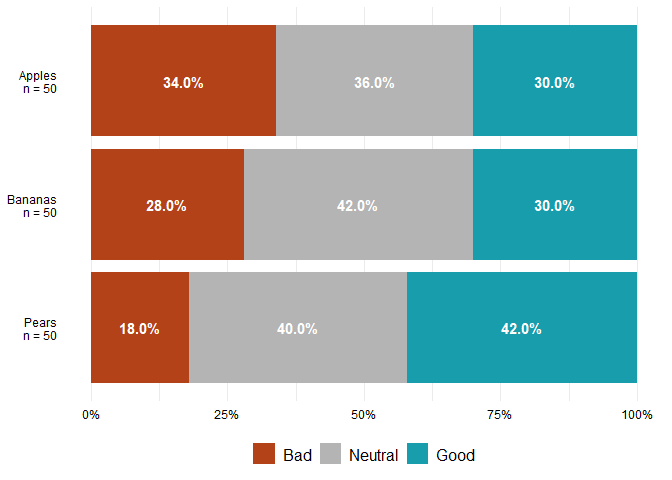
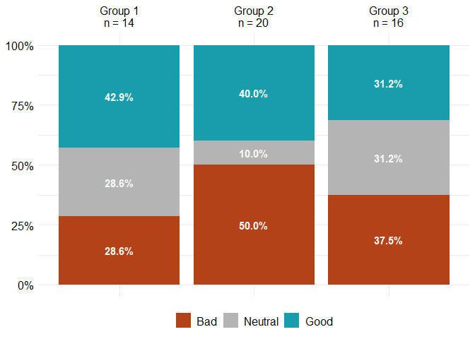
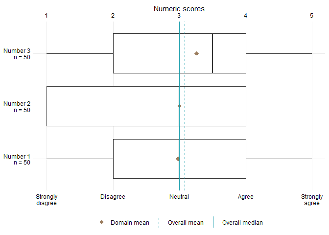
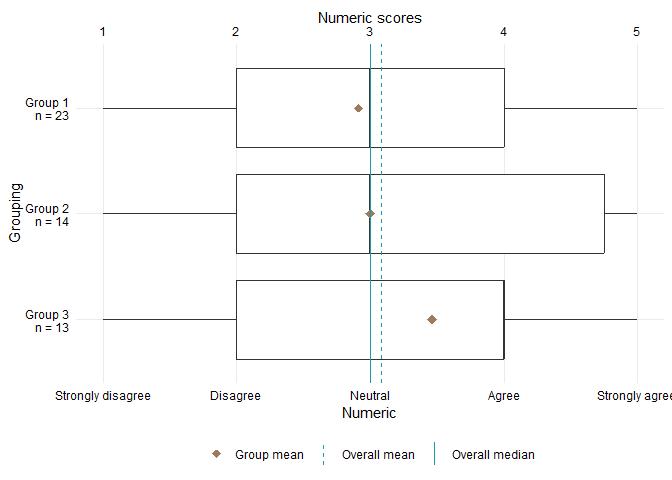

<!-- README.md is generated from README.Rmd. Please edit that file -->

# rbrcutils

<!-- badges: start -->

<!-- badges: end -->

The goal of rbrcutils is to provide access to functions used commonly in
developing reports for the Rosemary Bryant AO Research Centre.

## Installation

You can install the development version of rbrcutils from
[GitHub](https://github.com/) with:

``` r
remotes::install_github("darchlp/rbrcutils")
```

## Example

Currently, this package provides functionality for producing plots to
visualise categorical variables (in the form of column plots) and
numerical variables (in the form of box and whisker plots). These plots
can either be a series of variables over the whole dataset
`consecutive_**_plot` or a single variable by a grouping variable
`**_group_plot`.

### Categorical variables

Plot a series of categorical variables over the whole data.

``` r
library(rbrcutils)
#> Warning: replacing previous import 'purrr::%@%' by 'rlang::%@%' when loading
#> 'rbrcutils'
#> Warning: replacing previous import 'purrr::flatten_lgl' by 'rlang::flatten_lgl'
#> when loading 'rbrcutils'
#> Warning: replacing previous import 'purrr::splice' by 'rlang::splice' when
#> loading 'rbrcutils'
#> Warning: replacing previous import 'purrr::flatten_chr' by 'rlang::flatten_chr'
#> when loading 'rbrcutils'
#> Warning: replacing previous import 'purrr::flatten_raw' by 'rlang::flatten_raw'
#> when loading 'rbrcutils'
#> Warning: replacing previous import 'purrr::flatten' by 'rlang::flatten' when
#> loading 'rbrcutils'
#> Warning: replacing previous import 'purrr::flatten_dbl' by 'rlang::flatten_dbl'
#> when loading 'rbrcutils'
#> Warning: replacing previous import 'purrr::invoke' by 'rlang::invoke' when
#> loading 'rbrcutils'
#> Warning: replacing previous import 'purrr::flatten_int' by 'rlang::flatten_int'
#> when loading 'rbrcutils'
df <- data.frame(
  "apples" = sample(
    forcats::as_factor(c("Good", "Neutral", "Bad")),
    size = 50,
    replace = T
  ),
  "bananas" = sample(
    forcats::as_factor(c("Good", "Neutral", "Bad")),
    size = 50,
    replace = T
  ),
  "pears" = sample(
    forcats::as_factor(c("Good", "Neutral", "Bad")),
    size = 50,
    replace = T
  )
)
consecutive_cat_plot(
  df,
  c("Apples" = "apples", "Bananas" = "bananas", "Pears" = "pears"),
  colors = c(
    "Bad" = "#b44218",
    "Neutral" = "#b4b4b4",
    "Good" = "#179dab"
  )
)
#> Plot not saved
```



Or a categorical variable by a grouping variable.

``` r
library(rbrcutils)
df <- data.frame(
  "apples" = sample(
    forcats::as_factor(c("Good", "Neutral", "Bad")),
    size = 50,
    replace = TRUE
  ),
  "group" = sample(
    forcats::as_factor(c("Group 1", "Group 2", "Group 3")),
    size = 50,
    replace = TRUE
  )
)
cat_group_plot(
  df,
  xvar = "apples",
  yvar = "group",
  colors = c(
    "Bad" = "#b44218",
    "Neutral" = "#b4b4b4",
    "Good" = "#179dab"
  )
)
#> Plot not saved
```



### Numeric variable plot

Plot a series of numerical variables over the whole data.

``` r
library(rbrcutils)
df <- data.frame(
  "number1" = sample(1:5, size = 50, replace = T),
  "number2" = sample(1:5, size = 50, replace = T),
  "number3" = sample(1:5, size = 50, replace = T)
)
consecutive_box_plot(
  df,
  var = c(
    "Number 1" = "number1",
    "Number 2" = "number2",
    "Number 3" = "number3"
  ),
  labels = c(
    "1" = "Strongly diagree",
    "2" = "Disagree",
    "3" = "Neutral",
    "4" = "Agree",
    "5" = "Strongly agree"
  ),
  ordered_mean = T
)
#> Plot not saved
```



Or a numeric variable by a grouping variable.

``` r
library(rbrcutils)
df <- data.frame(
  "number" = sample(1:5, size = 50, replace = TRUE),
  "group" = sample(
    forcats::as_factor(c("Group 1", "Group 2", "Group 3")),
    size = 50,
    replace = TRUE
  )
)

box_group_plot(
  df,
  xvar = "number",
  xvar_name = "Numeric",
  yvar = "group",
  yvar_name = "Grouping",
  labels = c(
    "1" = "Strongly disagree",
    "2" = "Disagree",
    "3" = "Neutral",
    "4" = "Agree",
    "5" = "Strongly agree"
  )
)
#> Plot not saved
#> Warning: Use of `.df[[xvar]]` is discouraged.
#> ℹ Use `.data[[xvar]]` instead.
#> Use of `.df[[xvar]]` is discouraged.
#> ℹ Use `.data[[xvar]]` instead.
```



### Factored case_match and case_when

One of my favourite utilities are the `factored_case_match` and
`factored_case_when` functions. These are basically just wrappers around
the `dplyr::case_match` and `dplyr::case_when` functions, except it
returns a factor with the levels in order they were defined in the
original `...` argument.

``` r
library(rbrcutils)

df <- data.frame(
  a = c(1, 3, NA, NA, 5, 2),
  b = c(2, 3, NA, 5, 1, 4)
)

lvl <- rlang::exprs(
  4 ~ "Large",
  3 ~ "Medium",
  2 ~ "Small",
  1 ~ "Very small"
)

dplyr::mutate(
  df,
    a_fct = factored_case_match(
      a,
      !!!lvl
    ),
    b_fct = factored_case_when(
      b == 1 ~ "Very small",
      b == 2 ~ "Small",
      b == 3 ~ "Medium",
      b == 4 ~ "Large",
      is.na(b) ~ "Missing",
      .default = NA
    )
  )
#> Warning: There was 1 warning in `dplyr::mutate()`.
#> ℹ In argument: `a_fct = factored_case_match(...)`.
#> Caused by warning:
#> ! 1 unknown level in `f`: Large
#>    a  b      a_fct      b_fct
#> 1  1  2 Very small      Small
#> 2  3  3     Medium     Medium
#> 3 NA NA       <NA>    Missing
#> 4 NA  5       <NA>       <NA>
#> 5  5  1       <NA> Very small
#> 6  2  4      Small      Large
```
